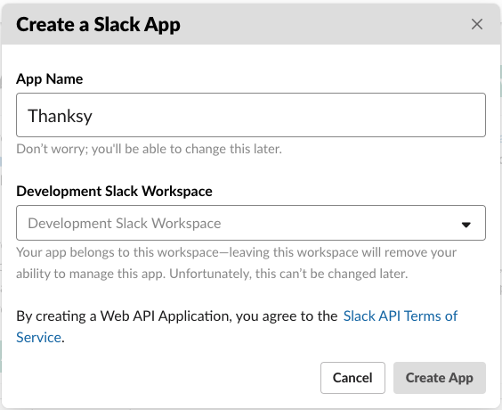
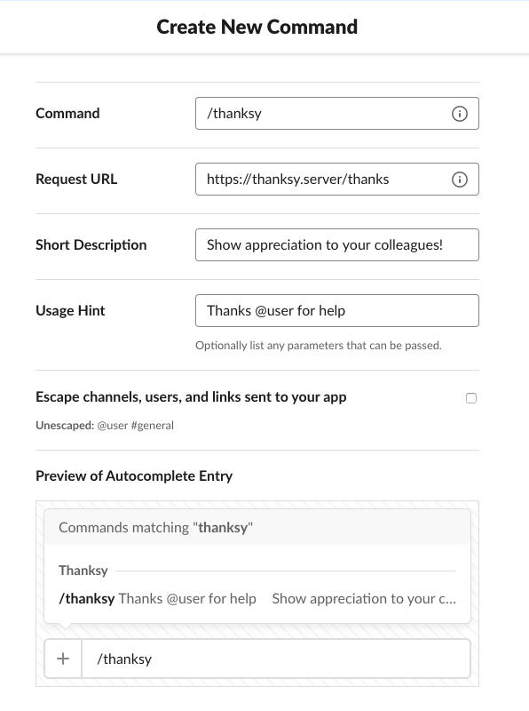
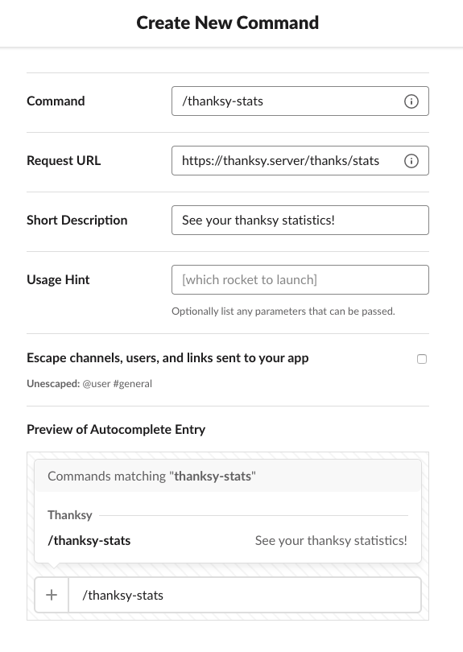
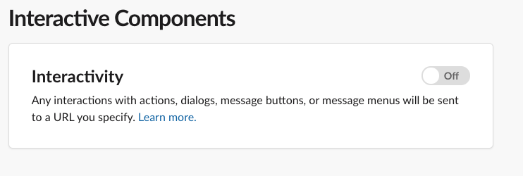
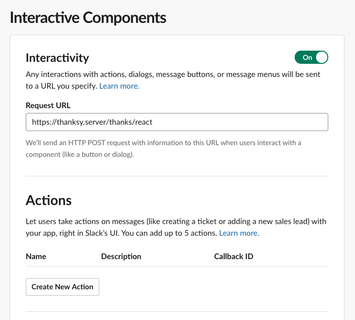
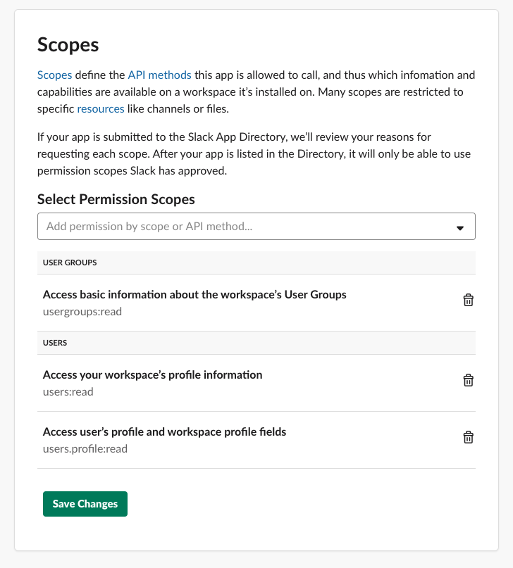
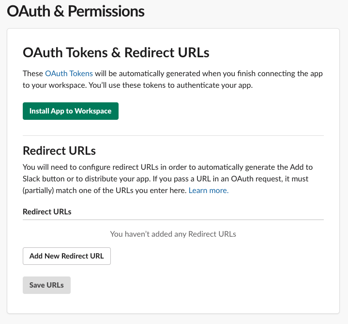

# Thanksy

## Deployment

    heroku create
    git push heroku master
    heroku run rake db:migrate
    heroku open

Alternatively, you can deploy your own copy of the app using the web-based flow:

## Building slack app

1. Visit the [Slack API vebsite](https://api.slack.com/) and click the `Start Building` button.
Then you will see the following popup. Fill in the name of the application (We recommend name `Thanksy`) and select your workspace.

2. The next step is to configure two commands. Click `Features -> Slash Commands` and use the `Create New Command` option to create them.
Remember to enter the appropriate server address. Replace the `thanksy.server` placeholder with the address of the application you deployed in the previous step.

3. `Click Features -> Interactive Components` and turn them on.

4. Fill in the `Request URL` used to send slack reactions. Replace the `thanksy.server` placeholder with the address of the application you deployed in the previous step.

5. At this step, specify a scopes. Thanksy saves some data to minimize the number of requests to the `Slack API` . To fetch this data, we require the following permissions:

6. If the scopes have been defined you can install you app.

## Development

### Prerequisites

    ruby 2.6.1

### PostgreSQL

If you don't have `PostgreSQL` locally, you can start a `Docker` container with following command:

    ./scripts/run_postgres.sh

### Fill .env

    cp .env.example .env

Then fill missing options in the `.env` file.

### Install dependencies

    bundle install

### Setup db

    rake db:recreate
    rake db:migrate

### Run the server

    rails s

### Run tests

    rspec
